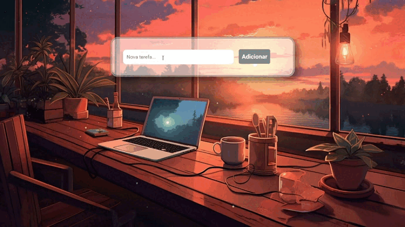

<h1 align="center"> Projeto To-Do List </h1>

  <a href="#-tecnologias">Tecnologias</a>&nbsp;&nbsp;&nbsp;|&nbsp;&nbsp;&nbsp;
  <a href="#-projeto">Projeto</a>&nbsp;&nbsp;&nbsp;|&nbsp;&nbsp;&nbsp;
  <a href="#memo-licença">Licença</a>

 

  

## 🚀 Tecnologias

Esse projeto foi desenvolvido com as seguintes tecnologias:

- HTML
- CSS
- JavaScript
- Git e Github

## 💻 Projeto

Projeto To Do List, para ajudar a fazer e organizar tarefas, o aplicativo tem uma boa interatividade com o usuário e foi programado para conseguir gravar dados em sua memória, assim quando o usuário abrir e fechar novamente a página, ainda estarão as últimas anotações feitas de tarefas pelo usuário.

